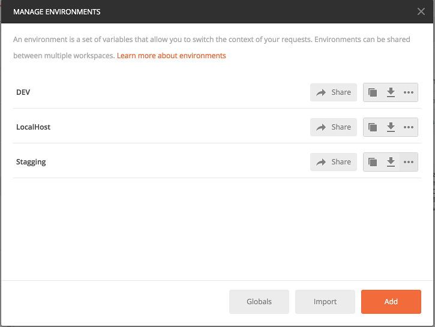
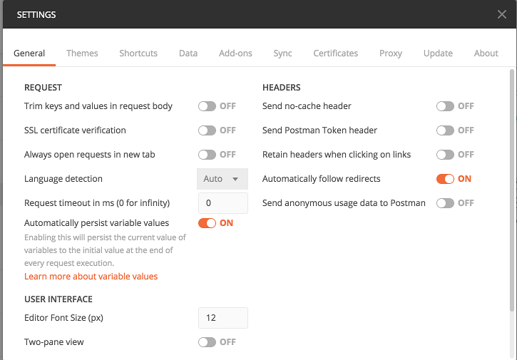

This document provides the details of **Postman Collection**.

## Postman Collection: ##

Postman test helps in testing the endpoint manually for any services. Postman collections are created for refdata, ITF and doc services. Each service has its own collection with token endpoint and other related end points.

## Download Postman: ##
Please download from this link
[Download Postman](https://www.getpostman.com/apps)

## Location for the postman test: ##

All postman collections located in ascent-test-framework.[Postman Collection location](https://github.com/department-of-veterans-affairs/ascent-test-framework/tree/development/src/test/resources/postmantest) 

## How to Import Postman collection? ##

1.	Click on the import button from the left corner in postman tool.
2.	Opens a dialogue box. Click on the tab Import File and click choose file.
3.	Select the collections from the your local </src/test/resources/postmantest/...> and click open.
4.	Collections is imported in postman.

## How to import Environment? ##

Created three environment variables for test execution localhost, dev and staging. Please import the environment variables from /src/test/resources/postmantest/environment variables-allservices

1.	Click on manage environment button from the right side of the tool (Small gear icon).
2.	Click on import. Choose file and select the files </src/test/resources/postmantest/environment variables-allservices/...> and open.
3.	All selected variables will be imported.

Click on the drop down environment, it displays all the environments imported. 
Based on the environment the values can be selected from the drop down.

## How to Add SSL certificate?  ##

Reference URL for setting up SSL certificate. [Refrence page for SSL](http://blog.getpostman.com/2017/12/05/set-and-view-ssl-certificates-with-postman/)

If you need a P12 file, Please request DevOps team they can provide the file. For each environment, there is a separate P12 file. Make sure you have P12 file each for Dev and stagging. 

1.	Open a terminal and navigate to the folder where you have the P12 file.
2.	Use this command to generate CERT <openssl pkcs12 -in <name of the p12 file> -nokeys -out my_key_store.crt>
3.	It prompts to enter the password, cert is created in the same location.
4.	Use this command to generate key file <openssl pkcs12 -in <name of the p12 file> -nocerts -nodes -out my_store.key>
5.	It prompts to enter the password, key file is created in the same location.
6.	Now navigate to postman, From the menu bar click on the settings icon. Opens up a dialog box, click on the certificates tab.
7.	Click on add certificate. Opens up add client certificate window. Enter the below details 
              
              Host  https:// <Enter the env URL>  eg: dev.internal.vetservices.gov
              
              CRT file: Please choose the CRT file generated.
              
              KEY file: Please choose the  key file generated.
              
              Passphrase: Enter the password
8.	Click on add button. Certificate is added.

## Make sure the general tab in settings looks like the below screen shot.

